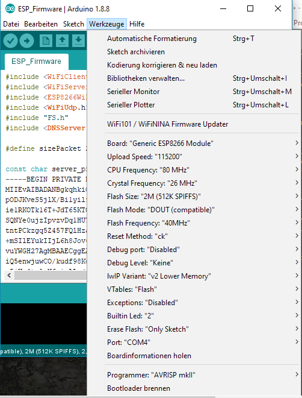
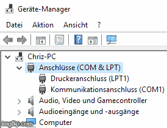

# LightControl
An easy to use smart light bundle with an Android app and Arduino firmware

# Hardware
For the Android app you need an Android device with enabled developer mode. To find out how to do that search for `developer mode <your phone name>` in Google.

For the WiFi chip the [ESP-01](https://de.aliexpress.com/item/2015-New-version-1PCS-ESP8266-serial-WIFI-model-ESP-01-Authenticity-Guaranteed-Internet-of-things/32473490612.html?spm=a2g0x.search0604.3.8.57764e91Kf4tD3&s=p&ws_ab_test=searchweb0_0,searchweb201602_2_10065_10068_10547_319_317_10548_10696_10084_453_10083_454_10618_10304_10307_10820_10821_537_10302_536_10902_10843_10059_10884_10887_321_322_10103,searchweb201603_56,ppcSwitch_0&algo_expid=e4b3ea0e-5d82-4207-b919-74437895bfe9-1&algo_pvid=e4b3ea0e-5d82-4207-b919-74437895bfe9&transAbTest=ae803_3) was used in our case. But in theory any WiFi chip that is compatible with the ESP8266 Arduino Core should work.

# Installation
First things first: Clone the repository:

```sh
git clone https://github.com/Chrizey91/LightControl.git
```
As this project consists of two parts (the Android app and the Arduino firmware) there are two things you need to install if you want to get the full experience.

## ESP firmware
To install the ESP firmware, you need to have the Arduino IDE installed. 

So first, download and install the latest version of the Arduino IDE from the official Ardiono website [here](https://www.arduino.cc/en/Main/Software). This thing is like Eclipse or IntelliJ. You will code your firmware in here.

Then, add and install the ESP8266 Arduino core. Install instructions can be found [here](https://arduino-esp8266.readthedocs.io/en/latest/installing.html). This is a conglomerate of libraries specifically designed for the ESP8266 chip of which we will take heavy use of.

(Re)start your Arduino IDE and load the firmware called ESP_Firmware.ino, which you will find at `ESP_Firmware\ESP_Firmware.ino`.

Adjust the settings of your Arduino IDE as depicted in the following image:



To find out which Port to use, go into your Device-Manager and expand the `COM & LPT` section. Then plug in your ESP device and see which COM Port ist assigned to it. In the following gif you see that my ESP got assigned the COM Port 4, so I chose COM4 in my Arduino IDE settings.



Now simply put your ESP into flashing-mode and upload your sketch to it.

## Android app

Download and install [Android Studio](https://developer.android.com/studio/).

Connect your android device with active developer mode to you PC.

Open this project in Android Studio, hit run and chose your android device as the output device.

# Documentation

For the documentation please consider looking at the Wiki

# Contributing

I am happy to accept any help in any form. The best way to contribute right now is to look at the issues or maybe even write to me dirictly. It is just a small project, so I will probably answer. :)

## ESP firmware

My knowledge about firmware programming is very limited (yet). So any help here is appreciated.

Especially the SSL-stuff and app-to-firmware communication can be improved a lot, I guess.

## Android app

There are two parts of the app. The first one is the communication, which is a bunch of classes that handle the communication between the ESP-firmware and the app. The second one is the actual app itselfe.

The communication part could need some professional eyes looked upon in regards to safety and robustness. I worke myself into it a while ago but I am far of an expert to grade the current concept. Especially concerning the SSL stuff.

The app itselfe needs a lot of graphics (like images for the buttons and icons etc). I am not a graphic designer and in general very bad at it. So I am happy to get any pull requests regarding designs. Also checking the Android app conventions would be a big help. I tried to abide to [them](https://github.com/ribot/android-guidelines/blob/master/project_and_code_guidelines.md).

## General

Beside programming, there is the Wiki, commenting of the code and giving suggestions on what to do next. So if you aren't a programmer, you can still contribute. Especially when you are able to create nice graphics. If you look at the graphics in the Wiki, you will immediately see that there is some improvement to make.

# License and credits

Arduino IDE is developed and maintained by the Arduino team. The IDE is licensed under GPL.

The firmware and android app in this git are licensed under the MIT License.
